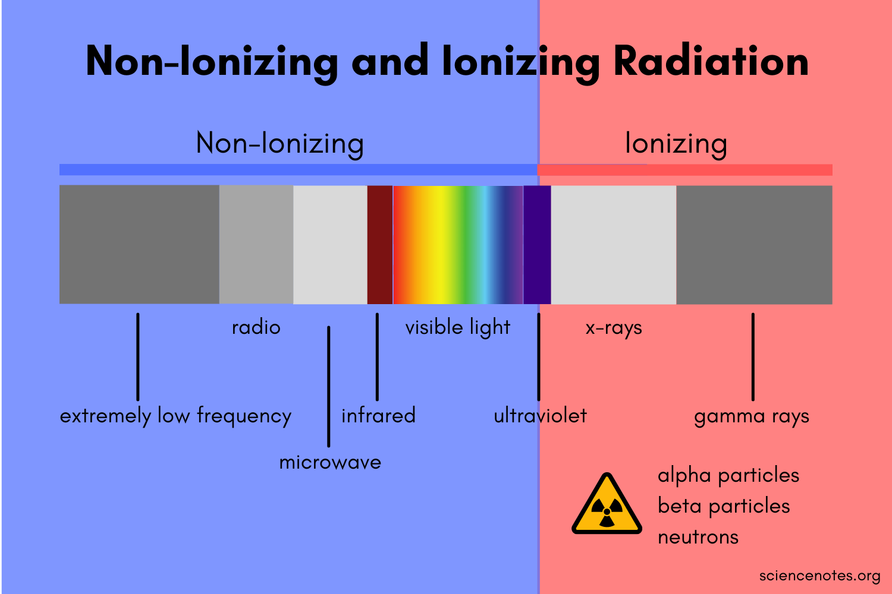

# RUC---Radiation-Unit-Converter
Simple program that allows you to convert radiation units.

# Available conversions:

-Per hour:

 -Roentgen to Sievert

 -Sievert to Roentgen
 
-Roentgen Equivalent Man:

  -rem to Sievert

-"milli" units per hour:

 -mSieverts to mRoentgen
 
 # NOTE:
If some formulas are incorrect, please report it and they will be fixed.

A future UI is planned with graphical charts, with a cross-platform API.

# USAGE:
```./main <initial_unit> <final_unit> <number>```

the program will automatically display the available units.

# Info chart

